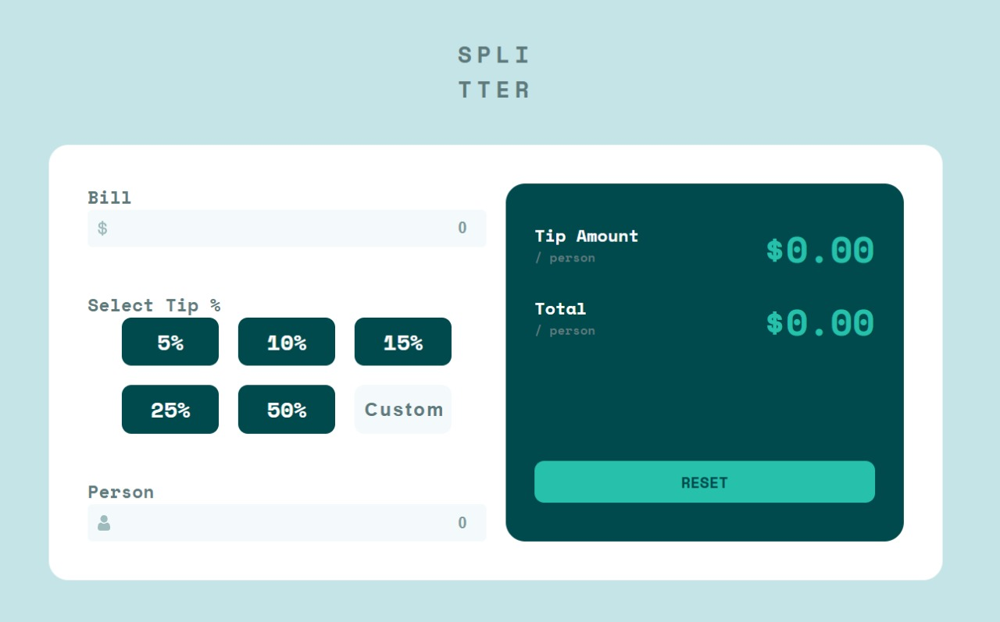
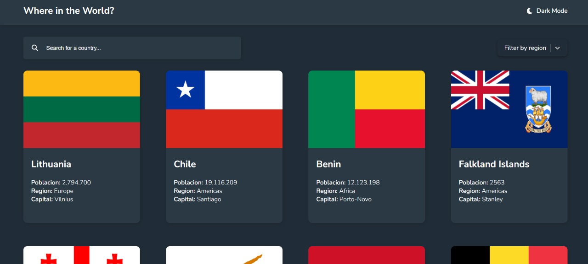
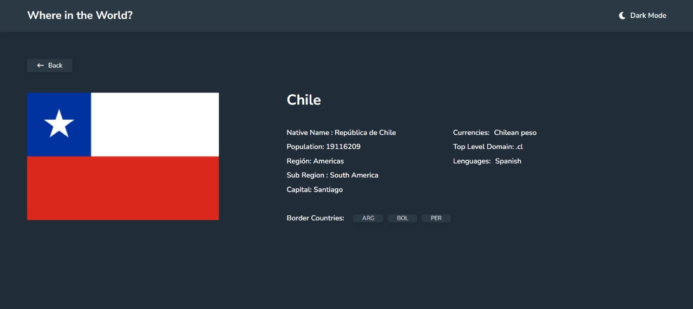
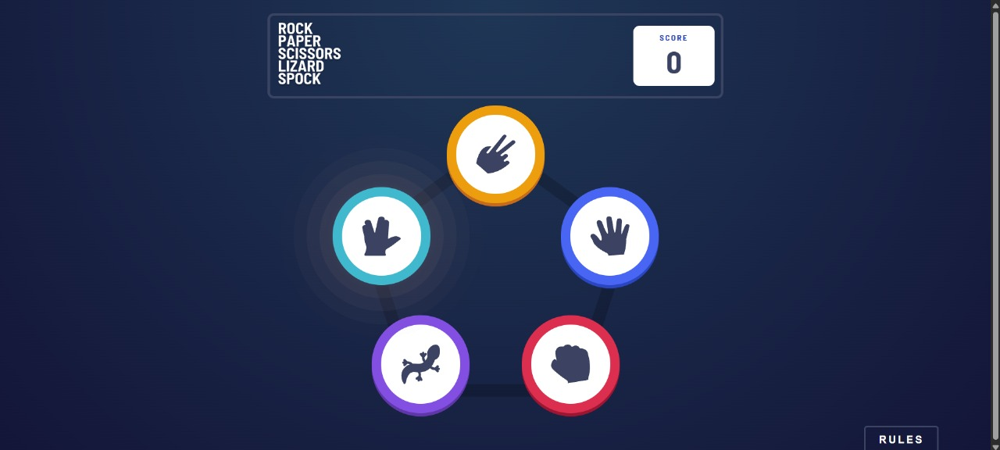
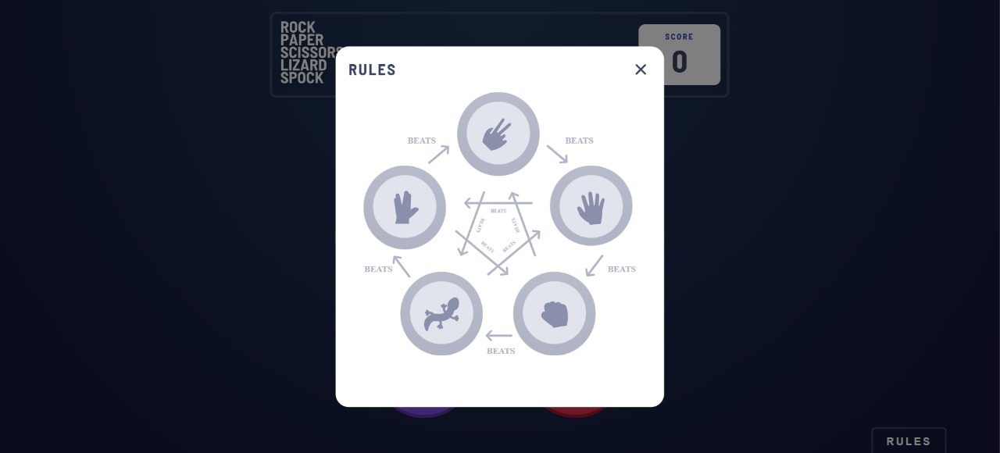
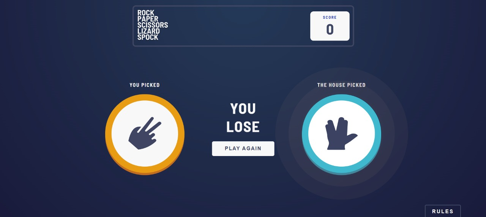
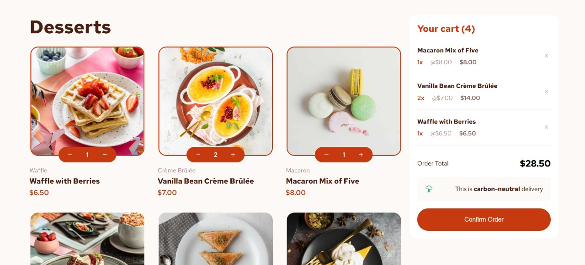
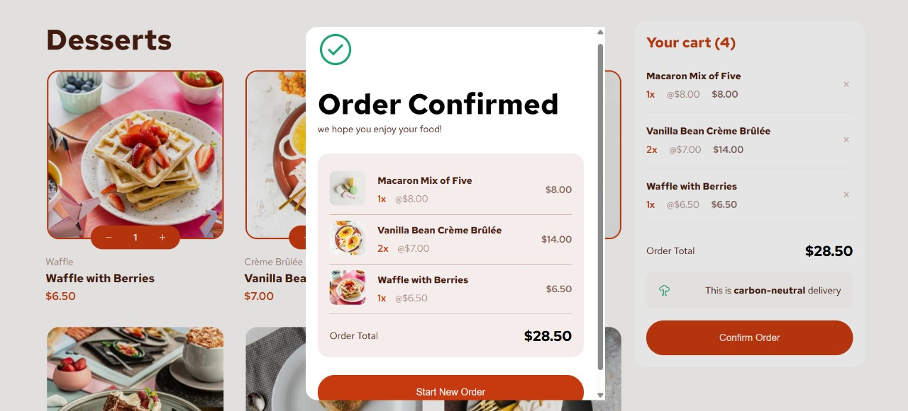
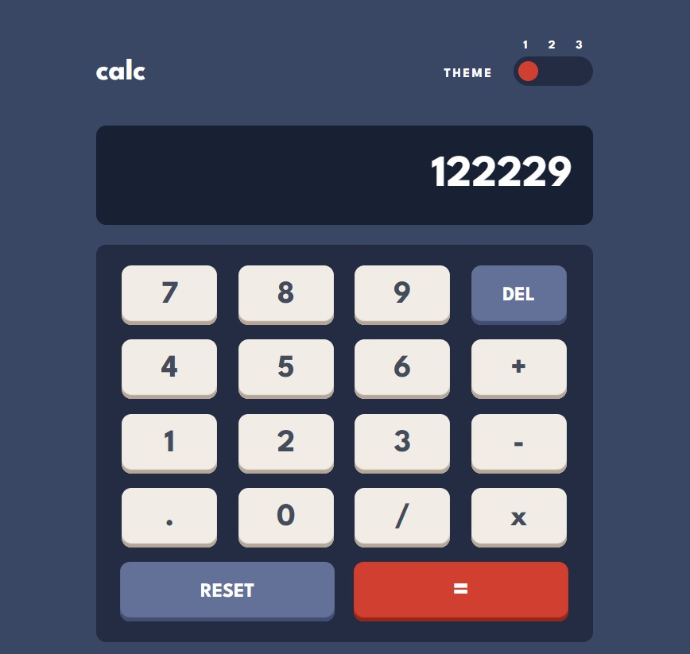
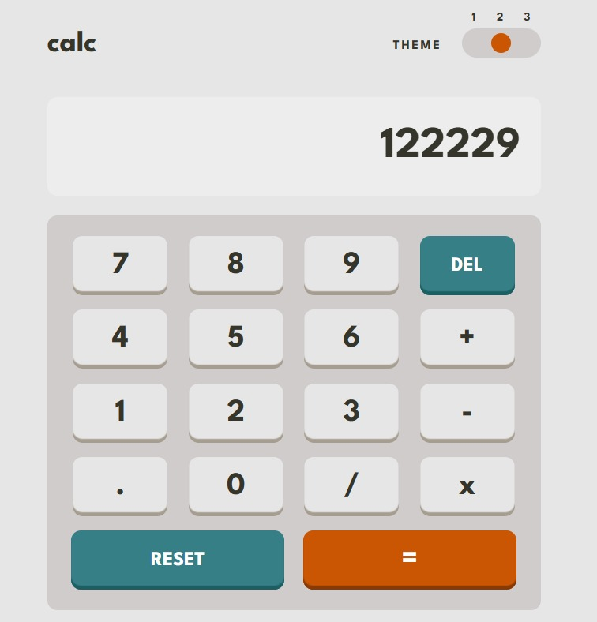

# Frontend Exercises

This repository contains solutions to various exercises from [Frontend Mentor](https://www.frontendmentor.io/profile/elvisjcb10), implemented using HTML, CSS, JavaScript, and React + Vite.

---

## Technologies

### Frontend
- HTML5 | CSS3 | JavaScript (ES6+)
- React + Vite
- Postman (for API testing)

---

## Featured Projects

### 1. Tip Calculator App
Interactive tip calculator developed with React.  
🔗 [View on Vercel](https://tipcalculator-lake.vercel.app/)  



---

### 2. REST Countries App
API consumption project to display countries and their details using the [REST Countries API](https://restcountries.com/). Includes theme switching (light/dark mode).  
🔗 [View on Vercel](https://restcountry-smoky.vercel.app/)  

  


---

### 3. Rock, Paper, Scissors, Lizard, Spock
Classic extended Rock, Paper, Scissors game implemented with React.  
🔗 [View on Vercel](https://rockscissorpaperbonus.vercel.app/)  

  
  


---

### 4. Product List with Cart
Classic shopping cart using HTML, CSS, and JavaScript, featuring interactive modals.  
🔗 [View on Vercel](https://productlist-two.vercel.app/)  

  


---

### 5. Calculator App
Interactive calculator using HTML, CSS, and JavaScript, with dynamic color themes.  
🔗 [View on Vercel](https://productlist-two.vercel.app/)  

  


---

## How to Use This Repository

1. Clone the repository:  
```bash
git clone https://github.com/elvisjcb10/frontend-exercises.git
